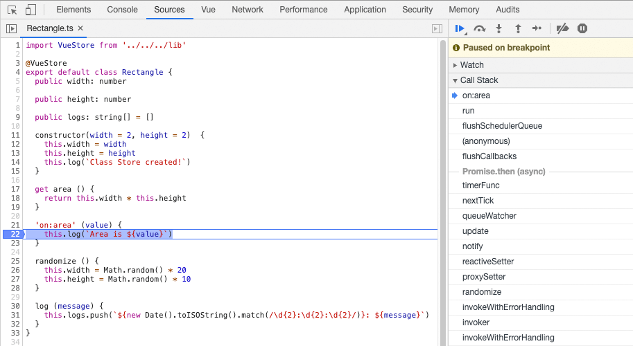
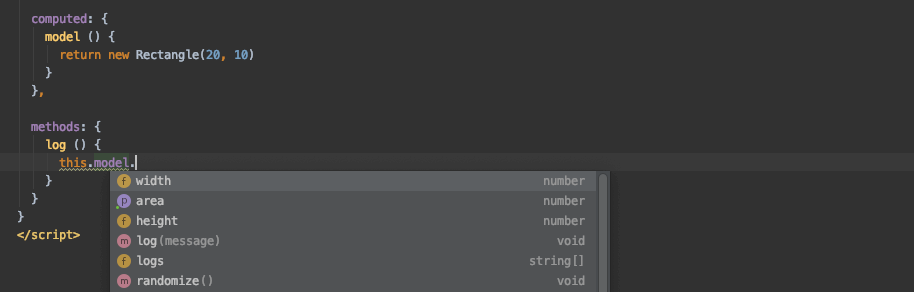

# Vue Class Store

> Zero-boilerplate class-based stores for Vue

## Abstract

#### Problem

Vue's reactivity system of reactive data, computed properties and watchers is amazing.

Unfortunately, to take advantage of this, you need to:

- use Options API format (props, data, computed, watch, methods and lifecycle hooks)
- use the Vuex Schema (actions, mutations, state, getters, modules, dispatches and commits)
- tollerate the quirks, caveats and boilerplate required by each system
- generally write a lot of extra code

Additionally, once your data is in your chosen format:

- you need to learn new concepts, jargon and rules
- you have to learn and adhere to best practices
- you may lose built-in tooling and code intelligence that the IDEs offer with standard JavaScript
- it's non-standard

#### Solution

Vue Class Store is a one-liner TypeScript decorator or single ES6 helper function that makes any class fully reactive, with computed properties, watched properties and methods.


Converted classes can be used locally or globally, outside or inside components, or even nested in other stores and are fully compatible with the Vue ecosystem because they are converted into `Vue` instances.

Debugging and breakpoints also work perfectly, and `this` refers to the class instance itself:



Even your IDE sees the models as classes, so you get full auto-complete on all the original members:



## Overview

#### Setup

Write your stores as ES6/TypeScript classes, and add the decorator `@VueStore`.

```typescript
@VueStore
export class Store {
  // properties are rebuilt as reactive data values
  public value: number

  // getters are converted to (cached) computed properties
  public get double (): number {
    return this.value * 2
  }

  // constructor parameters serve as props
  constructor (value: number = 1) {
    // constructor function serves as the created hook
    this.value = value
  }

  // special `on:` functions are converted to watches
  'on:value' () {
    console.log('value changed to:', this.value)
  }

  // class methods are added as methods
  log () {
    console.log('value is:', this.value)
  }
}
```

Behind the scenes, the decorator will convert the class to a new Vue instance.

#### Usage

To use the store, instantiate like the original class.

This can be standalone:

```typescript
const store = new Store(10)
```

Within another component:

```javascript
export default {
  props: {
    value: Number
  },
  
  computed: {
    model () {
      return new Store(this.value)
    }
  }
}
```

Or you could inject it into a component tree, simulating global state:

```javascript
export default {
  provide () {
    return {
      $store: new Store(10)
    }
  },
}
```

```javascript
export default {
  inject: [
    '$store'
  ],
  
  computed: {
    value () {
      return this.$store.value
    }
  }
}
```

## Examples

There is a demo folder to compare code; look in `src/demo/examples/*` to see:

- [Class Store](./src/demo/examples/class-store)
- [Vue Component](./src/demo/examples/vue-component)
- [Vue Model](./src/demo/examples/vue-model)
- [Vuex](./src/demo/examples/vuex)

Run the demo with:

```
npm run demo
```

