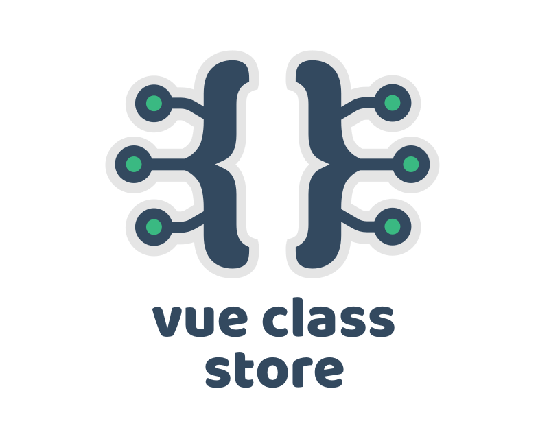
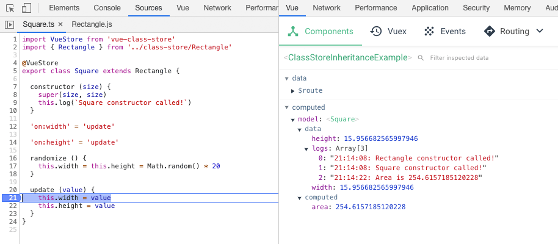

# Vue Class Store

> Universal Vue stores you write once and use anywhere



## Abstract

### So Vue, Vuex and Vue Class Store walk into a bar...

**Vue says:** "I'll give you reactivity, computed properties and watches, but only in components, only using a special objects-and-function schema, and I demand initial values be passed in from a parent component using props! I don't get along particularly well with TypeScript either, so good luck with figuring that one out, buddy"

**Vuex says:** "I'll give you global reactivity and computed properties, but I'm going to call them esoteric names and require you set them up globally with a convoluted schema, access them only through a centralised store, and I'll force you to make all updates through string-based paths, with different formats, helpers, terminology and best practices. I'll also make it difficult to go more than a couple of levels deep, and I'll give you watches but you'll hate them so probably best not to use those either"

**Vue Class Store says:** "I'll give you reactivity, computed properties and watches, written in standard JavaScript or TypeScript, with no setup or boilerplate, and you can use me anywhere"

*The end*

## Usage

### Installation

Install the package from NPM:

```bash
#vue 2
npm i vue-class-store@^2.0.0

#vue 3
npm i vue-class-store@^3.0.0
```

Yarn users, replace `npm i` with `yarn add`.

### Declaration

Write classes as normal, and add the decorator `@VueStore` to those you want to become reactive.

```typescript
import VueStore from 'vue-class-store'

@VueStore
export class Store {
  // properties are rebuilt as reactive data values
  public value: number

  // getters are converted to (cached) computed properties
  public get double (): number {
    return this.value * 2
  }

  // constructor parameters serve as props
  constructor (value: number = 1) {
    // constructor function serves as the created hook
    this.value = value
  }

  // prefix properties with `on:` to convert to watches
  'on:value' () {
    console.log('value changed to:', this.value)
  }

  // you can even drill into sub properties!
  'on:some.other.value' = 'log'

  // class methods are added as methods
  log () {
    console.log('value is:', this.value)
  }
}
```

### Instantiation

To use a store, simply instantiate the class.

You can do this outside of a component, and it will be completely reactive:

```typescript
const store = new Store({ ... })
```

Or you can instantiate within a component:

```javascript
export default {
  ...
  computed: {
    model () {
      return new Store({ ... })
    }
  }
}
```

Alternatively, you can make any non-decorated class reactive on the fly using the static `.create()` method:

```typescript
import VueStore from 'vue-class-store'
import Store from './Store'

const store: Store = VueStore.create(new Store({ ... }))
```

## How it works

This is probably a good point to stop and explain what is happening under the hood.

Immediately after the class is instantiated, the decorator function extracts the class' properties and methods and rebuilds either a new Vue instance (Vue 2) or a Proxy object (Vue 3).

This functionally-identical object is then returned, and thanks to TypeScript generics your IDE and the TypeScript compiler will think it's an instance of the *original* class, so code completion will just work.

Additionally, because all methods have their scope rebound to the original class, breakpoints will stop in the right place, and you can even call the class keyword `super` and it will resolve correctly up the prototype chain.



Note that the object will of course be a `Vue` or `Proxy` instance, so running code like  `store instanceof Store` will return `false` .

## Inheritance

The decorator supports class inheritance meaning you can do things like this:

```typescript
class Rectangle {
  width = 0
  height = 0
  
  constructor (width, height) {
    this.width = width
    this.height = height
  }
  
  get area () { return this.width * this.height }
}

@VueStore
class Square extends Rectangle {
  constructor (size) {
    super(size, size)
  }

  'on:width' (value) { this.height = value }
  'on:height' (value) { this.width = value }
}
```

Make sure you **don't inherit from another decorated class** because the original link to the prototype chain will have been broken by the substituted object returned by the previous decorator:

```typescript
// don't do this!

@VueStore
class Rectangle { ... }

@VueStore
class Square extends Rectangle { ... }
```

If you need to keep the original Rectangle and Square intact, decorate a final empty class that leaves the original classes untouched:

```typescript
// do this instead...

class Rectangle { ... }
class Square extends Rectangle { ... }

@VueStore
class SquareStore extends Square { } 
```

Alternatively, use inline creation:

```typescript
import Square from './Square'

const model: Square = VueStore.create(new Square(10))
```

## Global / shared state

Because the class itself is reactive, you could inject it into a component tree, simulating global state:

```javascript
export default {
  provide () {
    return {
      $products: new ProductsStore()
    }
  },
}
```

```javascript
export default {
  inject: [
    '$products'
  ],
  
  computed: {
    items () {
      return this.$products.items
    }
  },
  
  filterProducts (value) {
    this.$products.filter = value
  }
}
```

## Development

### Demo

The library has demos for Vue 2, Vue 3 and Nuxt, and can be found in the following repo:

- https://github.com/davestewart/vue-class-store-demos

### Scripts

The package uses Yarn, and has only two scripts, to build for development and production:

- `yarn dev` - build and watch for development
- `yarn build` - build for production

